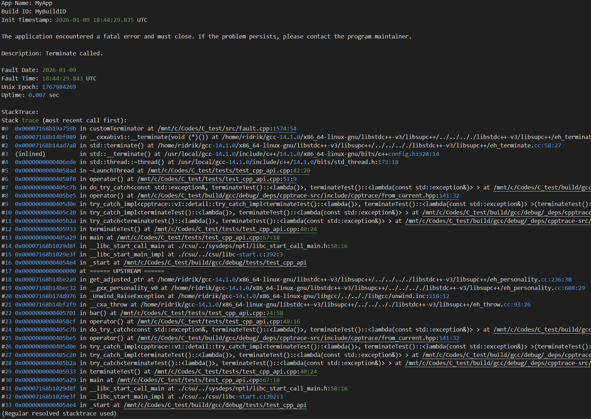

# libfault

libfault is a lightweight, cross-platform crash reporting and panic library for C++20 Linux and Windows. It provides a unified interface for saving object traces when things go wrong, whether it's a segmentation fault on Linux, an unhandled exception on Windows, a std::terminate or a manual panic/assertion call in your logic.

## Description

When a C++ application crashes, the default behavior is often a silent exit or a cryptic "Segmentation Fault" message. libfault changes this by intercepting system-level failures and providing developers with the context needed to debug them later, even from production contexts. It abstracts away the platform-specific complexities of POSIX signals and Windows Structured Exception Handling (SEH).

### Key Features
* **Native C & C++ Support:** Use the modern C++ API or the stable C-linkage interface for legacy projects.
* **Unified Crash Handling:** Intercepts SIGSEGV, SIGFPE, SIGILL, and SIGABRT on Linux, and SEH Exceptions on Windows.
* **Async-Signal Safe (AS-Safe):** Prioritizes safe "Object Trace" generation on restrictive environments, or has safeguards for user requested unsafe generation. See below for more info.
* **C++ Terminate Override:** Captures the stack trace of unhandled C++ exceptions before the runtime kills the process.
* **Zero-Config Stack Traces:** Powered by `cpptrace` for high-quality, symbolicated traces.
* **Panic & Assert API:** Provides `fault::panic()`, `fault::expect()`, `fault::expect_at()`, `fault::verify()` and `FAULT_ASSERT` for explicit, fail-fast error handling.
* **Self-Contained:** Can be bundled as a single shared library with no external runtime dependencies for the consumer.
* **User configurability:** Each fault action triggers report writing, user fatal Popups and summary message to terminal. User can switch these on/off independently for abnormal crashes, or user requested panic mode.

---

### Production & Async-Signal Safety

libfault is designed for high-availability production environments where stability during a crash is non-negotiable.

* **Async-Signal Safe (AS-Safe) Collection:** During a fatal signal (Linux) or exception (Windows), the library avoids using the heap or complex C++ runtime calls as much as possible. It prioritizes collecting signal safe "Raw Object Trace", a collection of instruction pointers with memory offsets and binary paths, using the `cpptrace` efforts as deriving mechanism.
* **Best-effort Safeguards** If no safe trace can be collected, the user may optionally activate a best-effort approach to collect a regular trace. In this case, the library puts safeguards in place against deadlocks or recursive crashes, to ensure that the program is terminated cleanly, wether the (unsafe) trace is collected or not.
* **Delayed Resolution:** Instead of resolving symbols (function names/filenames) inside the crashed process, libfault outputs a formatted "object trace" in its log.
* **Protected Debug Files:** Developers can resolve these traces locally using their original `.debug` or `.pdb` files. This means your production binaries can remain stripped (small and secure), while your logs remain fully actionable.
* **Trace Resolution is optional** Traces can be optionally resolved for non-restrictive environments, if the user wishes. For safety, this is never done in Linux Posix or Windows SEH environments.

---

## Quick Start

### 1. Integration (CMake FetchContent)
Add this to your `CMakeLists.txt` to integrate libfault directly into your project:

```cmake
include(FetchContent)
FetchContent_Declare(
    fault
    GIT_REPOSITORY [https://github.com/Ridrik/libfault.git](https://github.com/Ridrik/libfault.git)
    GIT_TAG v0.1.0
)
FetchContent_MakeAvailable(fault)

# Link to your application
target_link_libraries(my_app PRIVATE fault::fault)
```


### 2. Basic usage

Initialize the global handlers at the start of your `main()` function.

```cpp
void foo() {
    volatile int* p{nullptr};
    *p = 42;
}

int main() {
    // Initialize global crash handlers (Signals, SEH, and Terminate)
    if (!fault::init({.appName = "MyApp",
                      .buildID = "MyBuildID",
                      .crashDir = "crash",
                      .useUnsafeStacktraceOnSignalFallback = true,
                      .generateMiniDumpWindows = true})) {
        std::cerr << "Failed to initialize libfault.\n";
        return EXIT_FAILURE;
    }

    foo();

    return 0;
}
```

Will output:


As well as a crash report, containing summaries, timing info and object traces (see below). On Windows, if set, it also generates a minidump to the same directory (.dmp file)


### 3. Multi-thread fault proof

libfault is resillient to edge cases where multiple threads concurrently perform abnormal operations

```cpp
void foo() {
    volatile int* p{nullptr};
    *p = 42;
}

int main() {
    // Initialize global crash handlers (Signals, SEH, and Terminate)
    if (!fault::init({.appName = "MyApp",
                      .buildID = "MyBuildID",
                      .crashDir = "crash",
                      .useUnsafeStacktraceOnSignalFallback = true,
                      .resolveNonSignalTrace = true,
                      .generateMiniDumpWindows = true})) {
        std::cerr << "Failed to initialize libfault.\n";
        return EXIT_FAILURE;
    }

    // Multi threading stress test - only one fault should register consistently
    for (std::uint8_t i{0}; i < 6; ++i) {
        std::thread([i] {
            if (i == 0 || i == 2) {
                foo();
            }
            if (i == 1 || i == 3) {
                std::terminate();
            }
            if (i == 4) {
                std::abort();
            }
            throw std::logic_error("Shouldn't have happened");
        }).detach();
    }
    std::this_thread::sleep_for(std::chrono::milliseconds(100));
    fault::panic("Some error");

    return 0;
}
```
Will produce consistent behaviour, only registering the 1st fault to enter any handler


## 4. Integrates well with cpptrace

libfault uses `cpptrace` to produce smooth cross-platform traces. This also includes the ability to recover trace from exceptions at the throw site. Note the following example:

```cpp
void terminateTest() {
    cpptrace::try_catch(
        [] {
            struct LaunchThread {
                LaunchThread() : t{[] { std::this_thread::sleep_for(std::chrono::seconds(1)); }} {}

                std::thread t;  // calls std::terminate if in a joinable state
            } a;

            bar();  // throws

            a.t.join();
        },
        [](const std::exception& e) {
            // Deal with it, recover or exit
        });
}

int main() {
    // Initialize global crash handlers (Signals, SEH, and Terminate)
    if (!fault::init({.appName = "MyApp",
                      .buildID = "MyBuildID",
                      .crashDir = "crash",
                      .resolveNonSignalTrace = true})) {
        std::cerr << "Failed to initialize libfault.\n";
        return EXIT_FAILURE;
    }

    terminateTest();

    return 0;
}
```

The user has a cpptrace::try_catch installed, and is explicitly joining the std::thread created. However, during execution, some function throws. Before reaching the `catch`, `LaunchThread` destructor runs, which sees std::thread in a joinable state and calls std::terminate. With normal object tracing, the user would have no idea (directly) that it was bar() that threw. By combining traces from exceptions in libfault terminate handler, one can reach:



A fake frame is put in the middle, labelled "====== UPSTREAM ======" for user visibility. Now, the user will know not only what triggered the terminate (the joinable thread), but where the initial fault was.

### 5. Panic, Assertions, Expectations

libfault also allows users to explicitly abort the program with similar actions and reports as the signal/termination handlers. Namely, the user may:

1. **panic** panic may be called at any point to display terminal message, user popup, reports and dumps, before aborting the program.
2. **FAULT_ASSERT** fault assert is an assertion macro that checks for invariants, and panics if the assertion fails, displaying location information. By default, it only compiles in debug builds, but may be overriden by using `FAULT_ASSERTIONS=ON/OFF/Default`
3. **fault::expect**, **fault::expect_at**. Similar to assertions, it performs invariant checks, panicking if failing. However, these are present also in release builds. **fault::expect_at** always displays location information (line, function, file), whereas, by default, **fault::expect** hides them on non-debug builds. Users may override `fault::expect` location memory by using `FAULT_USE_LOCATIONS=ON/OFF/Default`
4. **fault::verify**. Similar to the above, but it is present in any build type, and will never show location information.

### 6. Utilities

libfault provides the following utilities:

1. Shutdown requests: if set, it registers SIGINT and SIGTERM to set shutdown requests. This allows users to check, on their code, whenever a termination request has come by simply calling **fault::has_shutdown_request**. Users may also set themselves a shutdown request by calling **fault::set_shutdown_request**, useful for multi-threaded applications.

---

## 🧩 Third-Party Components and Licenses
libfault uses `cpptrace` as driving mechanism to collect object traces smoothly across both platforms, and, whenever applicable, signal safe traces. 

| Component | Purpose | License |
| ---------- | -------- | -------- |
| [**cpptrace**](https://github.com/jeremy-rifkin/cpptrace) | Lightweight stack trace and debugging helper | MIT** |

---

## License
`libfault` is licensed under the **MIT License** (see `LICENSE` file).

### Third-Party Dependency Licensing
**`libfault` depends on [cpptrace](https://github.com/jeremy-rifkin/cpptrace). 
* **Standard Build:** MIT.
* **With libdwarf:** If `cpptrace` is configured to use `libdwarf` and is linked **statically**, the resulting binary is subject to the **LGPL** license.

---