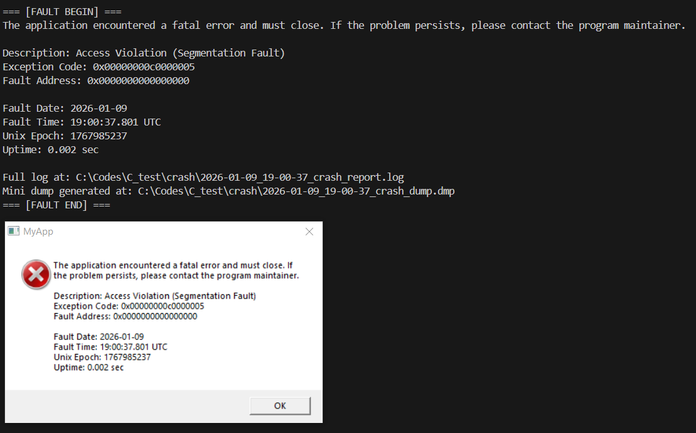
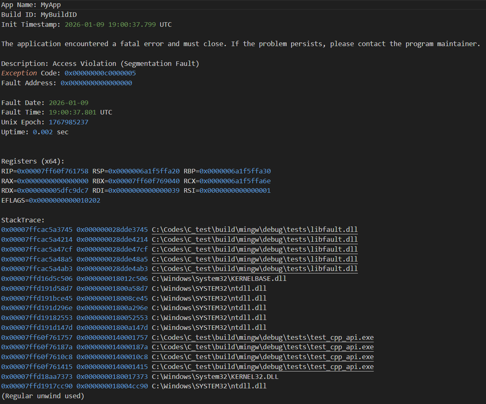
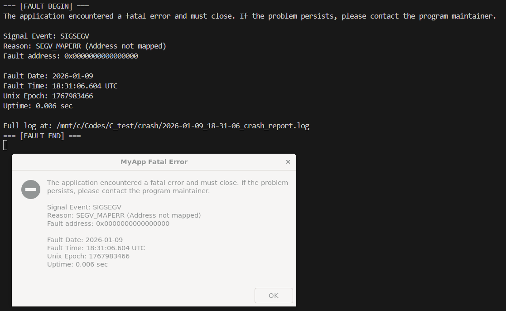
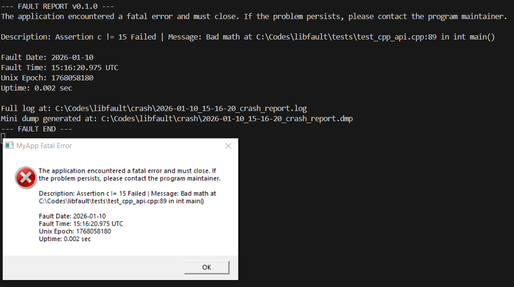
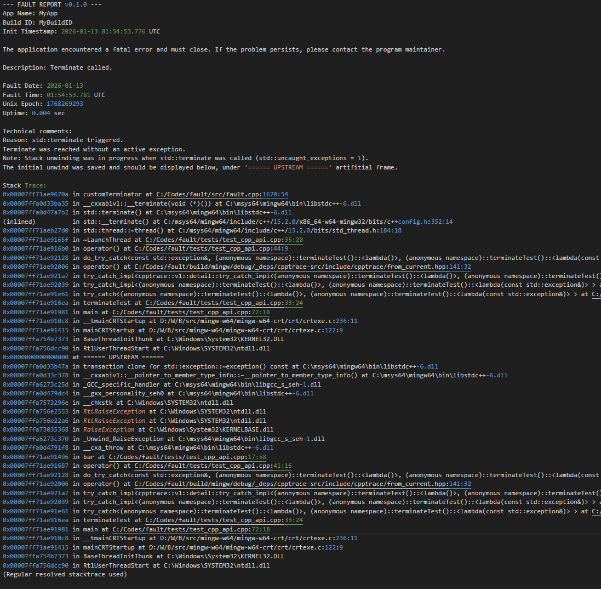
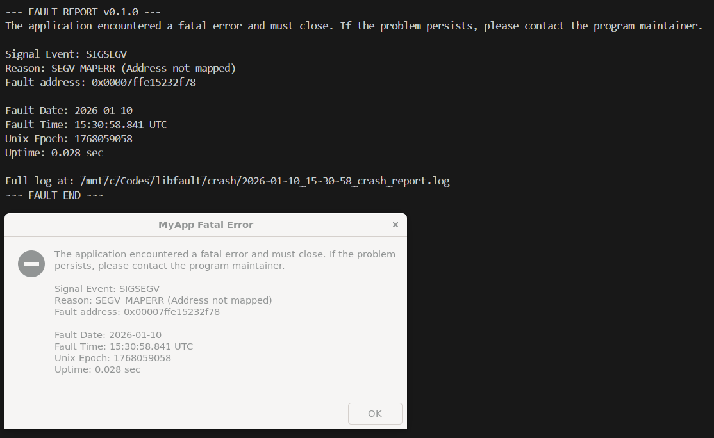
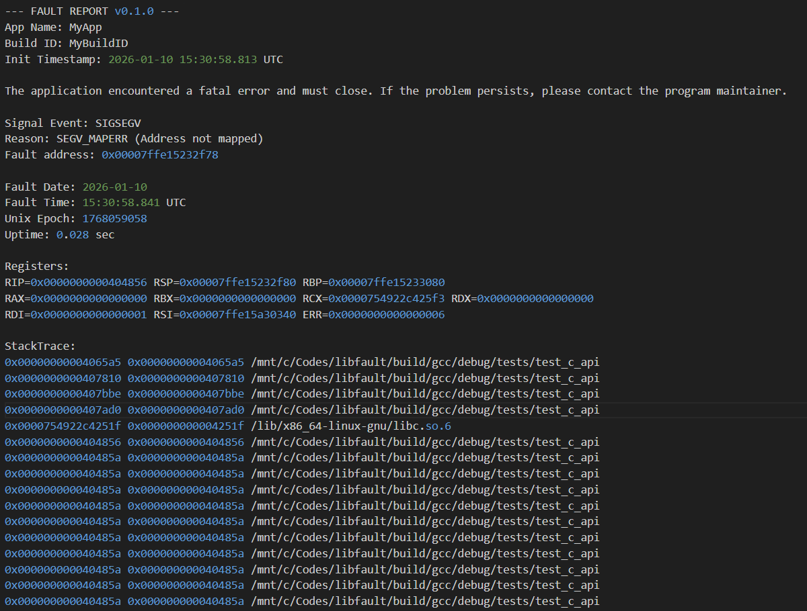

### 🔗 Quick Links
[📜 License](./LICENSE) | [📝 Changelog](./CHANGELOG.md) | [⚖️ 3rd Party Licenses](./LICENSE_3RD_PARTY)


# `fault`

`fault` is a lightweight crash reporting and panic library for C and C++, implemented in C++20. It provides a unified interface for alerting users, saving fault context and trace information when things go wrong, such as segmentation faults on Linux, unhandled SEH exceptions on Windows, std::terminate, or explicit panics and assertions.


### Description

When a C++ application crashes, the default behavior is often a silent exit or a cryptic "Segmentation Fault" message. `fault` changes this by intercepting system-level failures and providing developers with the context needed to debug them later, even from production contexts. It abstracts away the platform-specific complexities of POSIX signals and Windows Structured Exception Handling (SEH).

`fault` operates both at signal level and at c++ higher level, via its terminate handler and explicit `panic` modes. Whatever is the fault, `fault` performs common actions such as displaying a popup, terminal message, and writing a report, leaving both developers and potentially end users with some fatal context over silent and confusing crashes.


## Index
* [Key Features](#key-features)
  * [Production & Async-Signal Safety](#1-production--async-signal-safety)
* [Quick Start](#quick-start)
  * [Integration](#1-integration)
  * [Basic usage](#2-basic-usage)
* [Features](#features)
  * [Multi-thread fault proof](#1-multi-thread-fault-proof)
  * [Panic, Assertions, Expect](#2-panic-based-assertions)
  * [Panic](#3-panic)
    * [std::terminate + panic features](#31-stdterminate-handler--panic-features)
  * [try_catch cpptrace wrapper](#4-try_catch-integration-with-cpptrace-exception-traces)
    * [cpptrace direct usage](#41-explicitly-with-cpptrace)
  * [Panic Checkpoint hooks](#5-panic-hooks)
* [C-Language/Older C++ Support](#fault-in-c)
* [Utilities](#utilities)
* [Headers](#headers)
* [Author's Note](#authors-note)
* [Practical example](#practical-example)
* [Third party components](#-third-party-components-and-licenses)
* [License](#license)

---

## Key Features
* **Native C & C++ Support:** Use the modern C++ API or the stable C-linkage interface for legacy projects.
* **Unified Crash Handling:** Intercepts SIGSEGV, SIGBUS, SIGILL, SIGFPE and SIGABRT on Linux, and main SEH Exception codes on Windows, such as EXCEPTION_STACK_OVERFLOW, EXCEPTION_ACCESS_VIOLATION, divisions by zero, illegal instructions or data misalignments.
* **Async-Signal Safe (AS-Safe):** Prioritizes safe "Object Trace" generation on restrictive environments, or has safeguards for user requested unsafe generation. See below for more info.
* **C++ Terminate Override:** Captures the stack trace of unhandled C++ exceptions before the runtime kills the process.
* **User provided minimal context:** For applications you'd like to distribute to others, `fault` provides users a fatal popup if a critical error occurs, instead of risking a silent and confusing crash.
* **Zero-Config Stack Traces:** Powered by `cpptrace` for high-quality, symbolicated traces.
* **Panic & Assert API:** Provides `fault::panic()`, `fault::expect()`, `fault::expect_at()`, `fault::verify()` and `FAULT_ASSERT` for explicit, fail-fast error handling, including deferred evaluated on-failure actions.
* **Self-Contained:** Can be bundled as a single static or shared library with no external runtime dependencies for the consumer.
* **User configurability:** Each fault action triggers report writing, user fatal Popups and summary message to terminal. User can switch these on/off independently for abnormal crashes, or user requested panic mode.


### 1. Production & Async-Signal Safety

---

`fault` is designed for high-availability production environments where stability during a crash is non-negotiable.

* **Async-Signal Safe (AS-Safe) Collection:** During a fatal signal (Linux) or exception (Windows), the library avoids using the heap or complex C++ runtime calls as much as possible. It prioritizes collecting signal safe "Raw Object Trace", a collection of instruction pointers with memory offsets and binary paths, using the `cpptrace` efforts as deriving mechanism.
* **Best-effort Safeguards** If no safe trace can be collected, the user may optionally activate a best-effort approach to collect a regular trace. In this case, the library puts safeguards in place against deadlocks or recursive crashes, to ensure that the program is terminated cleanly, wether the (unsafe) trace is collected or not. **Note**: currently, on Windows, fully safe object traces can not be generated, and it is recommended for users to allow unsafe generation if a trace is desired. On Linux, safe traces can be collected only when using `libunwind` with `_dl_find_object`. By default, `fault` will choose libunwind configuration parameter when fetching `cpptrace`. Users may call fault::can_collect_safe_trace() to know wether a safe trace can be collected in restrictive environments.
* **Delayed Resolution:** Instead of resolving symbols (function names/filenames) inside the crashed process, `fault` outputs a formatted "object trace" in its log.
* **Protected Debug Files:** Developers can resolve these traces locally using their original `.debug` or `.pdb` files. This means your production binaries can remain stripped (small and secure), while your logs remain fully actionable.
* **Trace Resolution is optional** Traces can be optionally resolved for non-restrictive environments, if the user wishes. For safety, this is never done in Linux Posix or Windows SEH environments.

---

## Quick Start

### 1. Integration
Add this to your `CMakeLists.txt` to integrate `fault` directly into your project:

```cmake
include(FetchContent)
FetchContent_Declare(
    fault
    GIT_REPOSITORY [https://github.com/Ridrik/fault.git](https://github.com/Ridrik/fault.git)
    GIT_TAG v0.4.1
)
FetchContent_MakeAvailable(fault)

# Link to your application
target_link_libraries(my_app PRIVATE fault::fault)
```

By default, `fault` is fetched either as dynamic or static library, depending on ${BUILD_SHARED_LIBS} (On if not defined). Users may override it using FAULT_BUILD_SHARED=On/Off (boolean).
(Note: When building from source, cpptrace is fetched as part of it if FAULT_BUNDLE_CPPTRACE=On is selected (default), unless the target already exists. The same configurational options for cpptrace apply).

**Note** on State: If you link `fault` statically into multiple shared objects (DLLs/SOs) within the same process, each module will maintain its own independent configuration state. To share state across boundaries, build ``fault` as a shared library.

---

### 2. Basic usage

Initializing `fault` is done by a simple call, taking configuration parameters such as context names, report paths, and settings in what to execute/display in case of program abnormal behaviour.

```cpp

#include <iostream>

#include <fault/fault.hpp> // Or #include <fault/core.hpp> if no <format> options wanted

void foo() {
    volatile int* p{nullptr};
    *p = 42;
}

int main() {
    // Initialize global crash handlers (Signals, SEH, and Terminate)
    if (!fault::init({.appName = "MyApp",
                      .buildID = "MyBuildID",
                      .crashDir = "crash",
                      .useUnsafeStacktraceOnSignalFallback = true,
                      .generateMiniDumpWindows = true})) {
        std::cerr << "Failed to initialize fault.\n";
        return EXIT_FAILURE;
    }

    foo();

    return 0;
}
```

Will output:



As well as a crash report, containing summaries, timing info and object traces (see below). On Windows, if set, it also generates a minidump to the same directory (.dmp file)



[↑ Back to Top](#fault)

---

## Features

### 1. Multi-thread fault proof

`fault` is resillient to edge cases where multiple threads concurrently perform abnormal operations

```cpp
void foo() {
    volatile int* p{nullptr};
    *p = 42;
}

int main() {
    // Initialize global crash handlers (Signals, SEH, and Terminate)
    if (!fault::init({.appName = "MyApp",
                      .buildID = "MyBuildID",
                      .crashDir = "crash",
                      .useUnsafeStacktraceOnSignalFallback = true,
                      .resolveNonSignalTrace = true,
                      .generateMiniDumpWindows = true})) {
        std::cerr << "Failed to initialize fault.\n";
        return EXIT_FAILURE;
    }

    // Multi threading stress test - only one fault should register consistently
    for (std::uint8_t i{0}; i < 6; ++i) {
        std::thread([i] {
            if (i == 0 || i == 2) {
                foo();
            }
            if (i == 1 || i == 3) {
                std::terminate();
            }
            if (i == 4) {
                std::abort();
            }
            throw std::logic_error("Shouldn't have happened");
        }).detach();
    }
    std::this_thread::sleep_for(std::chrono::milliseconds(100));
    fault::panic("Some error");

    return 0;
}
```
Will produce consistent behaviour, only registering the 1st fault to enter any handler



[↑ Back to Top](#fault)

---

### 2. Panic-based Assertions

`fault` also allows users to explicitly abort the program with similar actions and reports as the signal/termination handlers. Namely, the user may:

1. **`panic`** panic may be called at any point to display terminal message, user popup, reports and dumps, before aborting the program.
2. **FAULT_ASSERT** fault assert is an assertion macro that checks for invariants, and panics if the assertion fails, displaying location information. By default, it only compiles in debug builds, but may be overriden by using `FAULT_ASSERTIONS=ON/OFF/DEFAULT` (as strings)
3. **fault::expect**, **fault::expect_at**, **FAULT_EXPECT**, **FAULT_EXPECT_AT**. Similar to assertions, it performs invariant checks, panicking if failing. However, these are present also in release builds. **fault::expect_at** always displays location information (line, function, file), whereas, by default, **fault::expect** hides them on non-debug builds. Users may override `fault::expect` location memory by using `FAULT_LOCATIONS=ON/OFF/DEFAULT` (as strings)
4. **fault::verify**. Similar to the above, but it is present in any build type, and will never show location information.

Example:

```cpp
int main() {
    // Initialize global crash handlers (Signals, SEH, and Terminate)
    if (!fault::init({.appName = "MyApp",
                      .buildID = "MyBuildID",
                      .crashDir = "crash",
                      .useUnsafeStacktraceOnSignalFallback = true,
                      .generateMiniDumpWindows = true})) {
        std::cerr << "Failed to initialize fault.\n";
        return EXIT_FAILURE;
    }

    Context context;

    const auto result = add(5, 2);

    // Assertion: compiles on debug builds by default, with source location
    FAULT_ASSERT(result == 7, "Math is broken");
    FAULT_ASSERT(result == 7, "Math is broken, expected {}, got {}", 7, result);
    FAULT_ASSERT(result == 7, [&] { 
        doSomething();
        const auto res = getSomeContext();
        return std::format("math is broken. Context: {}", res.to_string()); });

    // Expect: Always on, location information by default on debug builds
    fault::expect(result == 7, "Math is broken");
    
    // Each invariant check has a callable version for deferred evaluation
    fault::expect(result == 7, [&] {
        return std::format(
            "This is a large formatted string on the heap that prints a complex context struct {}. This callable "
            "provides deferred evaluation (only formats string on failure) and allows for follow up actions, if desired",
            context.to_string())
    });

    FAULT_EXPECT(result == 7,
                 "Math is broken");  // expression 'result == 7' is also displayed & string is only evaluated in the cold path
    // Or, with always source location
    fault::expect_at(result == 7, "Math is broken");

    // Always on, never with source location
    fault::verify(result == 7, "Math is broken");
    // verify, expect, expect_at and its macros (including FAULT_ASSERT) have overloads or versions for format strings
    fault::verify(result == 7, "Math is broken. Result is {}", result);
    fault::verify(result == 7, [&] { const auto res = getSomeContext(); return res.print(); });
    FAULT_VERIFY(result == 7);

    // Invariant failures on any of the above produces similar panic action
    const auto c = add(5, 10);
    FAULT_ASSERT(c != 15, "Bad math");

    // overloads on macros available as well
    FAULT_ASSERT(c != 15, "Bad math, got {}", c);

    return 0;
}
```

On debug build will abort with:




**Note** On Linux, if reraise signal is set, all these panic/assertions will end with reraising default SIGABRT, which usually prints the default abort message with core dumped (if system configured). On Windows, Minidump is instead explicitly generated if set on configuration, and afterwards the program is terminated. This follows the same final step as std::terminate handling.

**Note** All panic and assertions have overloads with invokable functions for deferred evaluation. In addition, there are also overloads or versions available for with formatted args, as long as the user includes `fault/format.hpp` or the general `fault/fault.hpp`. It is overloaded for all main expressions such as `FAULT_ASSERT`, `fault::panic`, `fault::verify`, `fault::expect`, `fault::expect_at` and their Macro versions.

### 3. Panic

**`fault::panic`** (or C's **`fault_panic`**) may be called explicitly by the user to perform a controlled program abort. It takes a user message string view (some overrides available). For instance, users may find it an useful feature after having caught a thrown exception in which the program needs to be aborted. `fault` makes it so that, whichever fault your program suffered, you get a saved trace report to resolve later, and your application users get a fatal popup instead of a silent crash. (**Note** that popups can be turned off in case the application is headless mode or when it must be restarted immediately)

```cpp
void foo() {
    throw std::runtime_error("Shouldn't have happened");
}

int main() {
    // Initialize global crash handlers (Signals, SEH, and Terminate)
    if (!fault::init({.appName = "MyApp",
                      .buildID = "MyBuildID",
                      .crashDir = "crash",
                      .useUnsafeStacktraceOnSignalFallback = true,
                      .generateMiniDumpWindows = true})) {
        std::cerr << "Failed to initialize fault.\n";
        return EXIT_FAILURE;
    }

    try {
        foo();
    } catch (const std::exception& e) {
        fault::panic("Exception caught: {}", e.what());
    }
}

```


### 3.1 std::terminate handler + panic features

`fault`'s std::terminate handler, as well as its `panic` expressions, try to gather some information about the fault context, and can provide both hints and enhanced traces to the developer in its report log:
- Did you have a try/catch, but while something in your code threw, a destructor threw again, resulting in a call to std::terminate? `fault` will see that and alert the user. Plus, if it's with `cpptrace` try/catch, it will even propagate the trace to not only show the std::terminate/panic context, but also what the initial fault (throw) was that triggered the unwind event (see [Example](#41-cpptrace-integration)).
- Did you save a trace to `fault` (see [Postponing traces and exceptions](#utilities)) but while you your threads were communicating or while your main thread was cleaning up, std::terminate or `panic` was triggered? It will also display as message and logs, including a dedicated propagated trace.

[↑ Back to Top](#fault)

---

### 4. try_catch integration with cpptrace exception traces
`fault` uses `cpptrace` internally to produce smooth cross-platform traces. This also includes `cpptrace`'s signature capability of retrieving a trace from thrown contexts at catch site, thanks to its unwind interceptor. `fault` leverages this capability and abstracts/wraps it in a way to offer it to consumers who'd rather have an all-in-one package, without needing to link to more libraries than needed.

**fault::try_catch**: a try/catch wrapper that uses `cpptrace` unwind interceptor, automatically storing traces from exceptions and executing a given `fault` catch policy, namely: calling `fault::panic` (no return); saving a traced exception and signaling for shutdown; or returning with no action. An onException callback is invoked before the policy is enacted, containing the exception pointer, and allowing users to perform any custom actions in it, including retrieving exception types given the `std::exception_ptr`, as well as returning a message that will be displayed for the description of the following `fault::panic` or saved exception trace, if any. 
Example:

```cpp
void foo() {
    std::this_thread::sleep_for(std::chrono::milliseconds(250));
    throw std::runtime_error("Shouldn't have happened");
}

int main() {
    // Initialize global crash handlers (Signals, SEH, and Terminate)
    if (!fault::init({.appName = "MyApp",
                      .buildID = "MyBuildID",
                      .crashDir = "crash",
                      .useUnsafeStacktraceOnSignalFallback = true,
                      .generateMiniDumpWindows = true})) {
        std::cerr << "Failed to initialize fault.\n";
        return EXIT_FAILURE;
    }
    // Example 1 -> execute your software, panicking if an exception triggers (which displays popup, message, and generates report),
    // Automatically logs a trace from exception (thrown context)
    fault::try_catch(foo, fault::CatchPolicy::kPanic);
    // Example 2 -> user provided callback
    fault::try_catch(foo, fault::CatchPolicy::kPanic,
                     [](std::exception_ptr ep, const fault::ObjectTrace& trace) -> std::string {
                         // You may want to analyze what exception was thrown, like you would if
                         // setting up try/catch yourself
                         try {
                             if (ep == nullptr) {
                                 return "";
                             }
                             std::rethrow_exception(ep);
                         } catch (const MyException& e) {
                             log_to_my_file(e.what());
                             return e.what();
                         } catch (const My2ndException& e) {
                             // ....
                         }
                         // etc. etc.
                     });
    // Example 3 -> deferred saving
    // Launch some thread (e.g your simulation)
    std::thread([]() {
        fault::try_catch(foo, fault::CatchPolicy::kSaveExceptionWithShutdownRequest);
    }).detach();
    // Main thread (could be your gui app)
    const auto now = std::chrono::steady_clock::now();
    while (!fault::has_shutdown_request()) {
        // Execute your app logic
    }
    fault::panic_if_has_saved_exception(std::format(
        "Hit after {} milliseconds", std::chrono::duration_cast<std::chrono::milliseconds>(
                                         std::chrono::steady_clock::now() - now)
                                         .count()));
}
```

#### 4.1 Explicitly with cpptrace
Whereas `cpptrace` is hidden by default to consumers, if one wishes to use it, there are some additions that can be used with `fault`. Expanding from the explanation above, for instance, `fault` will provide automatic traces from exceptions on terminate handling, or override traces for panic. See the example below:

```cpp
void terminateTest() {
    cpptrace::try_catch(
        [] {
            struct LaunchThread {
                LaunchThread() : t{[] { std::this_thread::sleep_for(std::chrono::seconds(1)); }} {}

                std::thread t;  // calls std::terminate if in a joinable state
            } a;

            bar();  // throws

            a.t.join();
        },
        [](const std::exception& e) {
            // Deal with it, recover or exit
        });
}

int main() {
    // Initialize global crash handlers (Signals, SEH, and Terminate)
    if (!fault::init({.appName = "MyApp",
                      .buildID = "MyBuildID",
                      .crashDir = "crash",
                      .resolveNonSignalTrace = true})) {
        std::cerr << "Failed to initialize fault.\n";
        return EXIT_FAILURE;
    }

    terminateTest();

    return 0;
}
```

The user has a cpptrace::try_catch installed, and is explicitly joining the std::thread created. However, during execution, some function throws. Before reaching the `catch`, `LaunchThread` destructor runs, which sees std::thread in a joinable state and calls std::terminate. Normal object tracing would report the joinable thread as the fault, but not what triggered such sequence. By combining traces from exceptions in `fault` terminate handler, it'll also include the initial fault (in bar): (Note: An artifitial frame is put in the middle, labelled "====== UPSTREAM ======" for user visibility)



Another useful example, where one can panic with an explicit trace from exception:

```cpp

#include <fault/fault.hpp>
#include <fault/adapter/stacktrace.hpp>

void foo() {
    throw std::runtime_error("Shouldn't have happened");
}

int main() {
    // Initialize global crash handlers (Signals, SEH, and Terminate)
    if (!fault::init({.appName = "MyApp",
                      .buildID = "MyBuildID",
                      .crashDir = "crash",
                      .useUnsafeStacktraceOnSignalFallback = true,
                      .generateMiniDumpWindows = true})) {
        std::cerr << "Failed to initialize fault.\n";
        return EXIT_FAILURE;
    }

    // Override traces
    cpptrace::try_catch([] { foo(); },
                        [](const std::exception& e) {
                            const auto cppObjectTrace =
                                cpptrace::raw_trace_from_current_exception().resolve_object_trace();
                            // needs #include "fault/adapter/stacktrace.hpp"
                            const auto objectTrace = fault::adapter::from_cpptrace(cppObjectTrace);
                            fault::panic(objectTrace, "Exception caught: {}", e.what());
                        });
}

```


[↑ Back to Top](#fault)

---

### 5. Panic Hooks

All assertions have options for deferred callbacks, which is helpful. But what if you have common information that you'd like to print for multiple assertions? You'd need to repeat the callback for each, which is ugly and verbose.

And what if you have other information, or actions, that you'd like see printed or performed, but are in a parent scope of the assertion? With standard libraries and features, this would be troublesome to do. To answer this, `fault` introduces the concept of panic checkpoints:

**Panic Hooks**: added user provided callbacks, in a RAII style, to be invoked if any panic, assertion failure, or std::terminate is called within the scope of such hook, in reverse order of registration. See the following example:

```cpp
namespace {

int add(int a, int b) {
    return a + b;
}

void bar() {
    fault::PanicGuard hook{[] { return "First 2 additions"; }, fault::HookScope::kThreadLocal};

    const auto res = add(5, 10);
    FAULT_ASSERT(res > 0, "{} with {} Should be positive", 5, 10);

    const auto res2 = add(1, 2);
    FAULT_ASSERT(res2 == res, "{} not the same as res2 {}", res, res2);
}

void foo() {
    fault::PanicGuard hook{[] { return "Adding some numbers that must stay coherent"; },
                           fault::HookScope::kGlobal};
    std::thread([] { bar(); }).detach();

    fault::panic("Shouldn't have happened!");
}

}  // namespace

int main() {
    // Initialize global crash handlers (Signals, SEH, and Terminate)
    if (!fault::init({.appName = "MyApp",
                      .buildID = "MyBuildID",
                      .crashDir = "crash",
                      .useUnsafeStacktraceOnSignalFallback = true,
                      .generateMiniDumpWindows = true})) {
        std::cerr << "Failed to initialize fault.\n";
        return EXIT_FAILURE;
    }

    fault::PanicGuard hook{[] { return "Print some general, app-wise context"; },
                           fault::HookScope::kGlobal};
    foo();

    return 0;
}
```

With relevant report output:

```
...
Technical comments:
Reason: panic triggered.

User provided panic callback messages:
(    GLOBAL    ) 0: Adding some numbers that must stay coherent
(    GLOBAL    ) 1: Print some general, app-wise context
...
```

if changing `foo()` to:

```cpp
void foo() {
    fault::PanicGuard hook{[] { return "Adding some numbers that must stay coherent"; },
                           fault::HookScope::kGlobal};
    std::thread([] { bar(); }).detach();
    std::this_thread::sleep_for(std::chrono::seconds(2));
    fault::panic("Shouldn't have happened!");
}
```

becomes:

```
...
Technical comments:
Reason: panic triggered.

User provided panic callback messages:
( Thread Local ) 1: First 2 additions
(    GLOBAL    ) 2: Adding some numbers that must stay coherent
(    GLOBAL    ) 3: Print some general, app-wise context
...
```

There's also `FAULT_DEBUG_GUARD`, which acts like fault::PanicGuard but gets compiled away as `FAULT_ASSERT` (that is, if `FAULT_ASSERTIONS` is `OFF`, or `DEFAULT` with `NDEBUG` builds).

Panic guards provide the user deferred common actions and messages to print should the program terminate via `panic` (including all assertions) or via `std::terminate`. Users may think of them like human-readable code checkpoints, and present invaluable potential for both debugging and even for traceability on production. Note that all callback messages get appended to the details section of the report (thus, not polluting the popup or terminal summary).

For `C` (or older `C++` standard when pre-compiled), equivalent options exist:

```c
const char* on_panic(void* data) {
    int* val = (int*)data;
    if (*val == 404) {
        return "Resource not found";
    }
    return "Unknown system failure";
}

void panic_callback(char* bf, size_t size, void* data) {
    snprintf(bf, size, "Some failure message");
}

int main() {
    FaultConfig config = fault_get_default_config();
    config.appName = "MyApp";
    config.buildID = "MyBuildID";
    config.crashDir = "crash";
    config.useUnsafeStacktraceOnSignalFallback = true;
    const FaultInitResult res =
        fault_init(&config);  // if no config changes wanted, user can call fault_init(NULL)
    if (!res.success) {
        printf("Failed to init fault\n");
        return 1;
    }

    fault_panic_guard_handle handle = fault_register_hook(panic_callback, NULL, kGlobal);
    fault_panic_guard_handle handle2 = FAULT_DHOOK_ADD(panic_callback, NULL, kGlobal);
    int status = 404;
    fault_verify_c(status == 200, on_panic, &status);
    FAULT_DHOOK_DEL(&handle2);
    fault_release_hook(&handle);
    printf("C API test passed\n");
    return 0;
}
```

Where `FAULT_DHOOK_ADD` and `FAULT_DHOOK_DEL` are safely compiled away as for `FAULT_ASSERT`.

[↑ Back to Top](#fault)

## Utilities

`fault` provides the following utilities:

1. Shutdown requests: if set, it registers SIGINT and SIGTERM to set shutdown requests. This allows users to check, on their code, whenever a termination request has come by simply calling **fault::has_shutdown_request** (`fault_has_shutdown_request` for C users). Users may also set themselves a shutdown request by calling **fault::set_shutdown_request** (`fault_set_shutdown_request` for C users), useful for multi-threaded applications.

2. Save exceptions across threads. Have you detected abnormal behaviour in one of your threads in which the program needs to abort, but you'd prefer to have it be the main thread to abort so that you can perform needed minimal cleanup your app needs to save user's data? `fault` makes it so you can save a trace and message from a given thread, and signal to main for a shutdown request. Your main logic can then check if a saved trace exists and panic. Result? Your report will contain not only the main trace, but the trace to which your thread requested to be saved.
**Note** You may also explicitly save a custom trace, if desired. If using `cpptrace::try_catch` (or similar with its unwind interceptor), `fault` automatically saves a trace from the current exception.
Example:

```cpp
// === Thread A ===
    const auto t = std::thread([] {
        try {
            std::this_thread::sleep_for(std::chrono::seconds(1));
            foo(); // throws
        } catch (const std::exception& e) {
            // Note: you may also pass a custom trace. If within cpptrace interceptor context,
            // fault automatically saves a trace from exception
            fault::save_traced_exception(std::format("Exception caught: {}", e.what()));
            fault::set_shutdown_request();
        }
    });


// === Main thread ===
while (!fault::has_shutdown_request() && !myWindow.shouldClose) {
    // Do main loop
}

// Loop exit, could have been normal termination (with your own logic), due to external request
// (SIGINT, SIGTERM), or due to thread exception:
if (fault::has_saved_traced_exception()) {
    doCriticalCleanup();
    fault::panic("Upstream exception"); // noreturn
}
doRegularCleanup();

// Or, more simply (if no side actions needed):
fault::panic_if_has_saved_exception("Upstream exception");
doRegularCleanup(); // Means no panic happened

```


3. **Symbol resolver** script, which can be found in `scripts/symbol_resolver.py`. It can resolve an object trace of the crash report given original .debug files in a subdirectory tree that can be mapped via the BUILD ID that the user gave to `fault` configuration. Alternately, if the fault happened on the same machine as the script, it can take directly the object paths reported in it.
Example: `python scripts/symbol_resolver.py --use_same_paths=1 path/to/crash_report.log`. **Note** it uses addr2line to resolve the trace. Feel free to customize it to your needs.


## `fault` in C

When pre-compiled, `fault` works for C consumers and C++ consumers on older standards, thanks to its `fault.h` API header. The behaviour largely mimics the one in C++.

```c
void infinite_recursion() {
    volatile char buffer[256];
    infinite_recursion();
    buffer[0] = 0;
}

int main() {
    FaultConfig config = fault_get_default_config();
    config.appName = "MyApp";
    config.buildID = "MyBuildID";
    config.crashDir = "crash";
    config.useUnsafeStacktraceOnSignalFallback = true;
    const FaultInitResult res =
        fault_init(&config);  // if no config changes wanted, user can call fault_init(NULL)
    if (!res.success) {
        printf("Failed to init fault\n");
        return 1;
    }

    infinite_recursion();  // Triggers seg fault on linux & stack overflow on windows

    // Example with callable for deferred evaluation (no source location, always on)
    int status = 404;
    fault_verify_c(status == 200, on_panic, &status);

    printf("C API test passed\n");
    return 0;
}
```

`fault` reserves stack on both platforms to ensure stack overflows are properly displayed.



With crash report:



(...continues)

Other macros/functions available: **FAULT_ASSERT** (default for debug, always with source location), **FAULT_EXPECT**, **FAULT_EXPECT_AT** (always on, by default `EXPECT` has source location on debug builds only), **FAULT_VERIFY**. All these macros have a macro version with suffix "_C", standing for callbacks. Examples:

**Note** For C++ users that want callback options: while you can use these versions reliably, it is recommended to use the embedded overloads in `fault::<function_name>` (which invokes any callable).

```c
const char* on_panic(void* data) {
    int* val = (int*)data;
    if (*val == 404) {
        return "Resource not found";
    }
    return "Unknown system failure";
}

int main() {
    FaultConfig config = fault_get_default_config();
    config.appName = "MyApp";
    config.buildID = "MyBuildID";
    config.crashDir = "crash";
    config.useUnsafeStacktraceOnSignalFallback = true;
    const FaultInitResult res =
        fault_init(&config);  // if no config changes wanted, user can call fault_init(NULL)
    if (!res.success) {
        printf("Failed to init fault\n");
        return 1;
    }
    int status = 404;
    FAULT_VERIFY_C(status == 200, on_panic, &status);
    FAULT_EXPECT_C(status == 200, on_panic, &status);
    FAULT_EXPECT_AT_C(status == 200, on_panic, &status);
    fault_verify_c(status == 200, on_panic, &status);

    printf("C API test passed\n");
    return 0;
}
```

[↑ Back to Top](#fault)

---

## Headers

Fault uses a main, core, header, alongside optional ones that extend functionality (as well as dependencies). A short summary of the public headers is seen below:

| Header | Purpose | Notes |
| ---------- | -------- | -------- |
| fault/core.hpp | core functionality, including initialization, panic & assertion, utilities | Suitable for most c++ consumers when not using format-based arguments or cpptrace adapter |
| fault/format.hpp | overloads or versions for panic and assertion functions & macros | Needed for std::format based strings |
| fault/fault.hpp | Everything accessible from `fault` C++ headers, minus the adapter | Recommended to use if you don't mind the `<format>` header |
| fault/adapter/stacktrace.hpp | Simple header-only conversion between `cpptrace` and `fault` | You'll only need this if you're using `cpptrace` directly and would like to provide a custom trace |
| fault/fault.h | Header for C consumers | If this library is pre-compiled, and you are using an older C++ version than C++20, then you may also use this |

---

## Author's Note

The goal of this library is to provide safeguards that work reliably against all common software faults, without the need of complex tools or dependencies. `fault` achieves a smooth, thread-safe, default-async-signal-safe operations and, when needed (or by redundancy), safeguards against unsafe trace generation. Apart from this, `fault` also warns the user with basic fatal popups instead of silent crashes, which you may find useful wether when debugging or for end users.

Another goal of `fault` is to be non-intrusive in saving a trace. It does not try to resolve symbols by default, making it useful for production scenarios where, in case of a fault, the user/client can simply send the reports for you to resolve locally given your debug files.

Lastly, `fault` provides a modern framework for `panic` based commands and assertions, which is backed up by `fault`'s overall termination handling. Users may find interesting as replacement for macros whenever applicable, as well as having invocable and format-based options, wether function-based or macro-based. Macros are also readily available for each version, and are still the choice for debug-only assertions.

[↑ Back to Top](#fault)

---

## Practical example

Below is a possible practical example for c++ consumers, where `fault` covers everything from signal faults, std::terminate, throw/catch with traces from exception, and custom panic and assertions.

```cpp
#include <thread>
#include <iostream>
#include <stdexception>
#include <format>

#include <fault/fault.hpp>

void App::startSim() {
    thread_ = std::make_unique<std::thread>([this] {
        fault::try_catch([this]{
            status_ = Status::kRunning;
            // Do simulation logic
            FAULT_ASSERT(speed > 0, "Got invalid speed {}", speed);
            FAULT_ASSERT(region_.contains(position), [this] {
                log("{}, {}, {}, {}, {}, {}", timestamp, utils::regionToStr(region_), position, velocity, aceleration, drag);
                return std::format("Region {} does not contain position {} at {}", utils::regionToStr(region_), position, timestamp);
            });
        }, fault::CatchPolicy::kSaveExceptionWithShutdownRequest, [this](std::exception_ptr /*ep*/, const fault::ObjectTrace& /*trace*/) {
            status_ = Status::kStopped;
            log("Caught exception on simulation");
            return "";
        });
    });
}

void App::run() {
    while (!fault::has_shutdown_request() && !windowShouldClose) {
        if (shouldStartSim()) {
            startSim();
        }
        checkGUI();
        drawFrame();
        renderFrame();
        // .... 
    }
}


int main() {
    if (!fault::init({.appName = "MyApp",
                      .buildID = "MyBuildID",
                      .crashDir = "crash",
                      .useUnsafeStacktraceOnSignalFallback = true,
                      .generateMiniDumpWindows = true})) {
        std::cerr << "Failed to initialize fault.\n";
        return EXIT_FAILURE;
    }

    int status{EXIT_FAILURE};
    fault::try_catch([&status] {
        // Here goes your app
        Context context;
        App myApp{context};
        myApp.run();
        fault::panic_if_has_saved_exception();
        status = EXIT_SUCCESS;
    }, fault::CatchPolicy::kPanic,
     [](std::exception_ptr ep, const fault::ObjectTrace& /*trace*/) -> std::string {
        try {   
            if (ep == nullptr) {
                return "";
            }
            std::rethrow_exception(ep);
        } catch (const MyInitializationException& e) {
            // Log something
        } catch (const MyLogicException& e) {
            const auto logicType = e.type();
            std::cerr << "Caught logic exception of type" << utils::typeToStr(logicType) << '\n';
            return std::format("Logic error of type: {}", utils::typeToStr(logicType));
        } catch (const std::exception& e) {
            return e.what();
        } catch (...) {
            return "";
        }
        return "";
    });

    return status;
}

```


[↑ Back to Top](#fault)

---


## 🧩 Third-Party Components and Licenses
`fault` uses `cpptrace` as driving mechanism to collect object traces smoothly across both platforms, and, whenever applicable, signal safe traces. See `LICENSE_3RD_PARTY` for the explicit component License.

| Component | Purpose | License |
| ---------- | -------- | -------- |
| [**cpptrace**](https://github.com/jeremy-rifkin/cpptrace) | Lightweight stack trace and debugging helper | MIT** |

---

## License
`fault` is licensed under the **MIT License** (see `LICENSE` file).

**`fault` depends on [cpptrace](https://github.com/jeremy-rifkin/cpptrace). 
* **Standard Build:** MIT.
* **With libdwarf:** If `cpptrace` is configured to use `libdwarf` and is linked **statically**, the resulting binary is subject to the **LGPL** license. Linking this condition statically to `fault` will therefore make the resulting binary LGPL.

[↑ Back to Top](#fault)

---